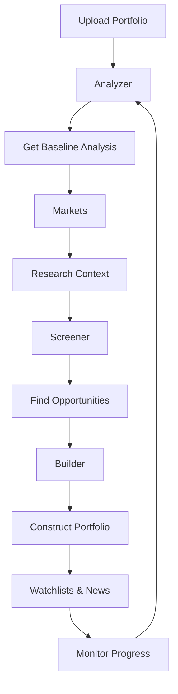

**See exactly how Parallax works through your complete investment workflow.** From portfolio upload to optimization, every step is designed around getting you actionable insights quickly.

## Your Investment Workflow

### Step 1: Portfolio Analysis (Analyzer Module)

**Your Starting Point**: Upload your existing portfolio or connect your brokerage account

**What You Get**: Instant AI-powered analysis showing:
- Overall portfolio score and risk assessment
- Factor exposure breakdown (Value, Quality, Momentum, Defensive, Size)
- Concentration risks and diversification opportunities
- Performance attribution and improvement suggestions

**Time Investment**: 2-3 minutes to upload, instant analysis

### Step 2: Market Intelligence (Markets Module)

**Your Research Hub**: Global market context and sector analysis

**What You Get**:
- Market intelligence integrated into stock analysis pages
- Top gaining/losing stocks with factor score context
- Currency impacts and international market trends
- Economic calendar and market-moving events

**Integration**: Market insights inform your portfolio decisions

### Step 3: Opportunity Discovery (Screener Module)

**Your Idea Generator**: Find investment opportunities systematically

**What You Get**:
- Pre-built strategies: "High Value Stocks", "Momentum Picks", "Defensive Plays"
- Custom screening with factor score filters
- Global stock universe with Parallax scoring
- Export capabilities to watchlists or portfolio builder

**Integration**: Screener results flow directly into portfolio construction

### Step 4: Portfolio Building (Builder Module)

**Your Construction Tool**: Create optimized portfolios using AI or templates

**What You Get**:
- **AI Builder**: Describe your goals in natural language, get complete portfolio
- **Curated Templates**: Institutional-grade thematic portfolios
- **Manual Construction**: Build custom portfolios with real-time factor analysis
- **Optimization**: AI-powered weight adjustments for better risk-return profiles

**Integration**: Built portfolios automatically analyzed for risk and performance

### Step 5: Ongoing Monitoring (Watchlists & News)

**Your Monitoring System**: Track portfolios and opportunities continuously

**What You Get**:
- **Portfolio Tracking**: Real-time updates on holdings and performance
- **Watchlist Management**: Monitor potential investments and research ideas
- **AI News Curation**: Portfolio-relevant news and market intelligence
- **Risk Alerts**: Automated notifications for significant changes

**Integration**: Monitoring feeds back into analysis and optimization cycles

## How Modules Work Together

Each module enhances the others, creating a comprehensive investment management ecosystem.

## AI-Powered Analytics Engine

<CardGroup cols={3}>
  <Card title="Machine Learning Models" icon="brain">
    **Pattern Recognition**: Advanced algorithms identify subtle patterns in price movements, fundamental data, and market structure.

    **Adaptive Learning**: Models continuously evolve as new data becomes available.
  </Card>

  <Card title="Natural Language Processing" icon="message">
    **Corporate Communications**: Automated analysis of earnings calls, SEC filings, and corporate announcements.

    **News Flow Analysis**: Real-time processing of financial news and social media.
  </Card>

  <Card title="Alternative Data" icon="database">
    **Non-Traditional Sources**: Satellite imagery, credit card transactions, social media sentiment.

    **Data Fusion**: Combining traditional and alternative data for enhanced predictions.
  </Card>
</CardGroup>

## RegTech Safeguards

Our platform includes comprehensive regulatory technology to ensure compliance and operational integrity:

### Digital Compliance Framework

1. **Automated KYC/AML**: Advanced identity verification and anti-money laundering protocols
2. **Risk Monitoring**: Real-time surveillance of trading activities and portfolio exposures
3. **Regulatory Reporting**: Automated generation of required regulatory filings and disclosures
4. **Audit Trails**: Comprehensive logging of all system activities and decision processes

### Data Protection & Security

- **End-to-end encryption** for all data transmission and storage
- **Multi-factor authentication** and role-based access controls
- **Regular security audits** and penetration testing
- **GDPR and privacy compliance** frameworks

## Technology Architecture

### Scalable Infrastructure

Our cloud-native architecture processes millions of data points daily while maintaining institutional-grade security and performance:

| Layer | Capabilities |
|-------|-------------|
| **Data Processing** | Multi-source integration, parallel processing, quality controls |
| **Analytics Engine** | Factor calculation, portfolio optimization, risk assessment |
| **Client Delivery** | Web dashboard, mobile access, API integration |

### Real-Time Capabilities

- **Live market data** integration from multiple exchanges
- **Continuous portfolio monitoring** with instant alert systems
- **Dynamic rebalancing** recommendations based on market conditions
- **Performance attribution** analysis updated throughout trading sessions

## Client Experience

### Customized Interfaces

**High Net Worth Clients**: Advanced analytics dashboards with detailed factor attribution, scenario analysis, and custom reporting capabilities.

**Affluent Investors**: Streamlined interfaces focusing on key performance metrics, clear explanations, and educational resources.

**Emerging Wealth**: Mobile-first design with simplified navigation, automated features, and gamified learning experiences.

### Educational Integration

- **Factor Explanations**: Clear, accessible explanations of investment concepts and methodologies
- **Performance Attribution**: Transparent breakdown of returns by factor, sector, and security
- **Market Commentary**: Regular insights and analysis from our research team
- **Interactive Tools**: Calculators, scenario analyzers, and portfolio simulators

## Why This Workflow Works

<CardGroup cols={2}>
  <Card title="Traditional Approach" icon="xmark">
    Research → Analyze → Build → Hope

    - Start from scratch each time
    - Disconnect between research and implementation
    - No feedback loop for improvement
    - Hope-based optimization
  </Card>

  <Card title="Parallax Approach" icon="check">
    Analyze What You Have → Optimize → Build Better → Monitor

    - Start with your existing portfolio
    - Data-driven optimization process
    - Continuous improvement cycle
    - Systematic monitoring and adjustment
  </Card>
</CardGroup>

This integrated workflow means:
- **Immediate Value**: Get insights about your current portfolio instantly
- **Systematic Improvement**: Each step builds on the previous analysis
- **Continuous Optimization**: Platform learns and adapts to your preferences
- **Risk Management**: Built-in safeguards at every step

## Ready to Experience Parallax?

**Start with Your Portfolio**: Upload your current holdings and see what institutional-grade analysis reveals about your investments.

- **No Risk**: Web-based platform, no downloads, secure analysis
- **Immediate Insights**: Get actionable recommendations in under 5 minutes

---

**Next Steps**:
- Jump in with our [Quick Start Guide](/console/quickstart) for immediate portfolio analysis
- Understand the methodology: [Parallax Methodology](/methodology/overview)
- Explore the analyzer: [Portfolio Analyzer](/console/analyzer)
