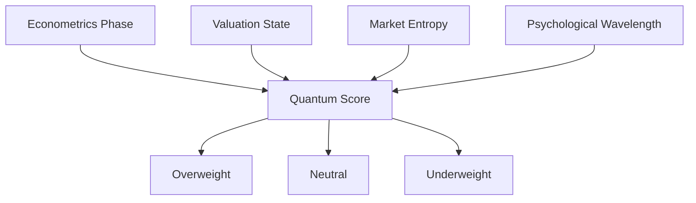

The Quantum Score is a single composite score that summarizes how attractive an asset looks right now, whether that asset is a regional equity market, a bond market or a currency. It is built from four pillars: economic conditions, valuation, technical trends, and investor psychology. Quantum Score is the label the reports use for this composite.

<Note>
**How this relates to the Parallax score.** The two are different instruments at different altitudes. The [Parallax score](/methodology/scoring) evaluates an individual security against the equity factor framework. The Quantum Score evaluates a whole market or asset class for cross-asset positioning. A market can score well while individual securities within it score poorly, and the reverse. Neither is derived from the other.
</Note>

## Beginner

### What It Means

Think of the Quantum Score as a four-lens camera. One lens looks at the economy, one at price versus value, one at the price trend and technicals, and one at investor mood. The score combines the four pictures into one number that says how attractive the asset looks overall.

### Example

Two equity markets might both have rallied recently. One scores well: its economy is accelerating, valuations are reasonable, the trend is firm, and investors remain skeptical (so there is room for opinion to improve). The other scores poorly: the economy is slowing, the market is expensive, the trend is fading, and everyone is already bullish. Same recent performance, opposite scores.

### Why It Matters

Allocation decisions fail most often when they rest on one dimension, buying cheap assets in deteriorating economies, or chasing strong trends at exhausted valuations. The Quantum Score forces four separate lenses to be weighed together, and no single pillar can carry the score on its own.

---

## Advanced

### How to Read It

The score is signed and centered on zero. Positive readings lean toward [Overweight](/glossary/overweight-neutral-underweight), negative readings lean toward Underweight, and a defined band around zero maps to Neutral. The global cross-asset report ranks regions by score, so every view is explicitly relative. When a report explains a score, it names which pillars are doing the lifting: "constructive on economic momentum, held back by valuation" tells you exactly where the tension in the view sits.

### The Four Pillars

| Pillar | What It Measures |
|--------|------------------|
| [Econometrics Phase](/glossary/econometrics-phase) | Economic cycle positioning and data momentum |
| [Valuation State](/glossary/valuation-state) | Relative valuation versus history and peers |
| [Market Entropy and Technicals](/glossary/market-entropy) | Technical trends and price action |
| [Psychological Wavelength](/glossary/psychological-wavelength) | Sentiment, positioning, and flows |

Each pillar score is set by the research team from the evidence described on the [data coverage page](/macro/data-coverage), rather than derived by the ingestion pipeline. The generation process then applies those scores consistently across every region and asset class, and explains them.

The four pillars compose into one signed score, which then maps to one of three view labels:

### Common Misreadings

- **Treating it as a forecast**: the score describes current positioning attractiveness, not a price target or a timing call
- **Ignoring the pillar decomposition**: two identical scores can have very different structures, one balanced across pillars, one strong on three and badly weak on the fourth, and the fragile one deserves more scrutiny
- **Comparing scores across weeks without reading the narrative**: the persistent memory in the generation process means a score change is accompanied by an explanation; the explanation is the substance

### Reading It Against the Report

Use the pillar language when challenging a view in committee. Disagreeing with an Overweight is most productive when you can name which pillar you dispute, the economic read, the valuation, the trend, or the sentiment assessment.

### Related Terms

<CardGroup cols={3}>
  <Card title="Overweight, Neutral, Underweight" href="/glossary/overweight-neutral-underweight">
    The view labels the score maps to
  </Card>
  <Card title="Econometrics Phase" href="/glossary/econometrics-phase">
    The economic pillar
  </Card>
  <Card title="Market Entropy and Technicals" href="/glossary/market-entropy">
    The technical pillar
  </Card>
</CardGroup>
