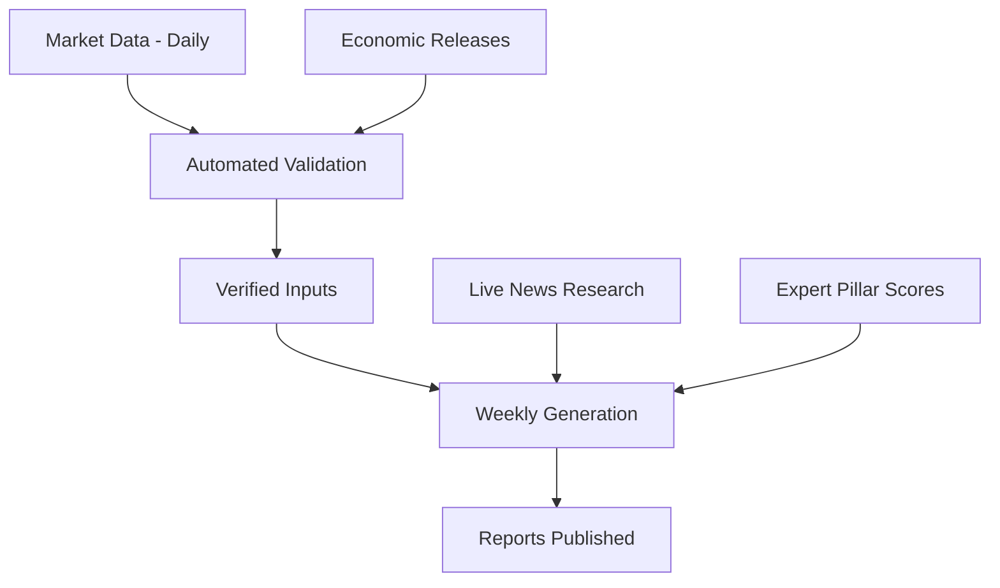

import MacroDisclaimer from '/snippets/macro-disclaimer.mdx';

Research is only as good as the data beneath it. Macro Reports sits on an ingestion layer that pulls, validates, and organizes market and economic data on each source's own publishing frequency.

<Note>
**The foundation:** Roughly 200 million rows of market and macro data sit beneath the reports. The figure is an inventory, not a headline: daily market series with multi-decade history, covering prices, yields, exchange rates, factor and sector readings and sentiment components, plus the full economic dashboard for every covered market. All of it is ingested and validated by automated pipelines, so every report is generated from data that is current as of the week it is written.
</Note>

## Executive Summary

**Categories**: Economic releases, fixed income, currencies, equity factors and sectors, sentiment and liquidity indicators, and market news.

**Cadence**: Each series refreshes at its natural frequency, market data daily; economic releases monthly and quarterly as statistical agencies publish them. Reports are generated weekly from the freshest available data.

**Discipline**: Data is computed into verified quantitative inputs *before* any writing begins, and a missing series produces an explicit omission in the report, never an invented number.

## Data Categories

<CardGroup cols={2}>
  <Card title="Economic Releases" icon="chart-column">
    **Coverage**: The full economic dashboard per market. Leading indicators, business and consumer confidence, manufacturing and services activity, inflation at consumer and producer level, employment, housing, money supply, trade and capital flows, and national accounts. Consensus forecasts are collected alongside the actuals, which is what makes a surprise measurable.

    **In the reports**: The key macro indicators section, the economic surprise index reading, and the evidence base the research team draws on when setting the cycle-position pillar of the positioning framework.
  </Card>
  <Card title="Fixed Income" icon="landmark">
    **Coverage**: Government bond yields across maturities, policy rates, and the derived measures that describe the rates environment, including curve shape and monthly and quarterly yield changes.

    **In the reports**: The fixed income section, the verified policy rate shared across sections, and the bonds side of the tactical allocation decision.
  </Card>
  <Card title="Currencies" icon="money-bill-transfer">
    **Coverage**: Exchange rates and their statistical context, historical distributions, z-scores, and technical readings, for covered markets.

    **In the reports**: The currency section's stretched-or-supported assessment and the currency-exposure lens applied throughout the tactical allocation analysis.
  </Card>
  <Card title="Equity Factors and Sectors" icon="layer-group">
    **Coverage**: Factor measurements across value, momentum, quality and related styles, including factor effectiveness readings and factor spreads, plus sector-level performance and dispersion (the spread between leading and lagging sectors) for each market.

    **In the reports**: The factor analysis, sector analysis, and sector positioning sections.
  </Card>
  <Card title="Sentiment and Liquidity" icon="wave-pulse">
    **Coverage**: The liquidity, momentum, and breadth components of the composite market-sentiment score, plus volatility and market-stress indicators.

    **In the reports**: The liquidity and sentiment section, the five-state sentiment regime classification, and the global risk-appetite aggregation in the cross-asset report.
  </Card>
  <Card title="Market News" icon="newspaper">
    **Coverage**: Current news researched live at generation time, central bank communications, policy developments, and market-moving events, rather than from a static news database.

    **In the reports**: The market news section and the narrative context woven through the synthesis.
  </Card>
  <Card title="Geopolitical and Policy Developments" icon="earth-americas">
    **Coverage**: Geopolitical risk, trade policy, and domestic political developments, researched by the analysts rather than drawn from a data feed, with a research window for structural developments deliberately wider than the weekly cycle.

    **In the reports**: A standing analytical dimension of the market news section, and an explicit input the tactical allocation section must weigh in its positioning call.
  </Card>
</CardGroup>

The cross-asset positioning framework additionally scores commodities alongside equities, fixed income, and currencies, so the global view is informed by all four asset classes. The framework's pillar scores are expert research inputs, maintained by the research team and consumed by the generation process, which applies them consistently across every region and asset class, they are not derived by the automated ingestion pipeline.

## The Automated Pipeline

Three kinds of input reach a report, and only one of them is automated end to end.

**Ingestion on natural frequencies.** Each series arrives on its natural frequency: daily for market prices, yields, currencies, and sentiment indicators; monthly and quarterly for economic releases. Each run reads the latest data available at generation time.

**Computation before narration.** When a report run begins, the quantitative layer computes everything first and in parallel, as pure data, before a single sentence is drafted: factor readings, spreads, z-scores, sentiment composites and technical measures. The writing stages then work exclusively from these verified inputs. Charts are rendered from the same computed values that drive the text, so a report's exhibits and its narrative stay consistent.

**Validation and graceful degradation.** Inputs are checked as they flow through the pipeline. When a series is unavailable for a market, the system does not improvise: the affected sections are explicitly informed of the gap and instructed to omit the topic. A gap in the data produces an explicit omission, not an invented number. A subscriber will occasionally see a report decline to cite a figure. That is the discipline working as designed. When too much of a report comes back empty, the pipeline fails loudly rather than silently padding.

## Market Coverage

Macro Reports covers developed and emerging markets across Asia, Europe, and the Americas, and every covered market receives the identical nine-section treatment, with the global cross-asset report spanning all covered regions. For the current market list, [contact us](https://parallax.chicago.global/contact).

## Explore Further

<CardGroup cols={2}>
  <Card title="Macro Reports" icon="newspaper" href="/macro/overview">
    The product overview and the value case.
  </Card>
  <Card title="Methodology" icon="gears" href="/macro/methodology">
    How data becomes a finished report.
  </Card>
  <Card title="Inside a Macro Report" icon="book-open" href="/macro/anatomy">
    Where each data category surfaces.
  </Card>
  <Card title="Glossary" icon="book" href="/glossary/overview">
    The measures defined in plain language.
  </Card>
</CardGroup>

---

<MacroDisclaimer />
