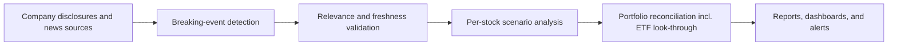

import MacroDisclaimer from '/snippets/macro-disclaimer.mdx';

Most news tools answer the question "what happened?" Parallax News Intelligence answers a harder one: "what does this mean for the portfolio I actually hold?" This page explains how the pipeline works, why it is built the way it is, and why you can rely on what it surfaces.

## The Problem

An investor overseeing positions across several markets faces a structural mismatch. News volume grows every year, while the window for acting on any single item keeps shrinking. Coverage universes expand faster than research teams do, so most professional investors monitor far more names than they can read about. The result is a familiar failure mode: the item that mattered was published, but nobody holding the position saw it in time.

Summarization helps, but only partly. A faster summary of a headline still leaves the hardest work to the reader: deciding whether the event touches anything they own, in what direction, and by roughly how much. That judgment is where hours actually go, and it is the step most news products skip entirely.

<Note>
News Intelligence is built around a simple principle: **relevance is defined by the portfolio, not by the headline.** An event only reaches you after it has been reconciled against what you actually hold, including positions held indirectly through ETFs.
</Note>

## How the Pipeline Works

Every item follows the same automated sequence. No step is discretionary and no step is skipped, so the output is repeatable: the same event and the same portfolio produce the same assessment.

| Step | What happens |
|------|--------------|
| **Monitor** | Continuous automated monitoring of company disclosures and news sources across major Asian and US equity markets |
| **Detect** | Keyword and relevance scoring surfaces potentially market-moving items as they break |
| **Validate** | A relevance and freshness check filters out stale, duplicated, or immaterial items before anything is scored |
| **Assess** | For each event that passes, automated analysis produces bull, base, and bear scenarios with probability-weighted price impact for the affected security |
| **Reconcile** | The assessed impact is mapped against actual portfolio holdings, including look-through into ETF constituents, so indirect exposure is captured alongside direct positions |
| **Deliver** | Results reach the people holding the affected positions through reports, dashboards, and alerts, with narrative context explaining the scenario math |

### Scenario Analysis, Not Sentiment Scores

A sentiment score on a headline tells you the tone of the coverage, not your exposure to the event, and it compresses the reasoning into a single number. News Intelligence instead produces an explicit scenario structure for each event: a bull case, a base case, and a bear case, each with an estimated price impact and an assigned probability. The output is a probability-weighted view you can interrogate, and because the scenario math is shown rather than summarized away, you can disagree with an input and still use the framework.

### Portfolio Reconciliation

This step is what separates News Intelligence from news summarization. The same event carries different weight for different portfolios, so the pipeline evaluates every detected event against your actual holdings. That includes ETF look-through: if an affected company sits inside an ETF you hold, the exposure is surfaced even though the name never appears on your position list. A portfolio with no exposure to an event, direct or indirect, is not interrupted by it.

## Why You Can Rely on It

News Intelligence is fully automated, and the trust case rests on the discipline of the system rather than on an editor reviewing each item.

<CardGroup cols={2}>
  <Card title="Systematic methodology" icon="gears">
    Every item passes through the same detection, validation, and assessment sequence. The process is repeatable and auditable: identical inputs produce identical outputs, which is a property no discretionary review process can offer.
  </Card>
  <Card title="Validation before delivery" icon="filter">
    Multiple automated checks stand between a raw headline and your dashboard. Items are scored for relevance, checked for freshness, and reconciled against holdings before anything is surfaced. Noise is filtered out early, by design.
  </Card>
  <Card title="Quant research discipline" icon="flask">
    The pipeline is built by the same research team that builds Parallax's factor scoring and valuation systems, and it inherits the same standards: explicit assumptions, traceable logic, and no black-box outputs.
  </Card>
  <Card title="Precision over breadth" icon="crosshairs">
    The filter is your portfolio. Rather than maximizing the count of items surfaced, the pipeline minimizes the number of irrelevant ones, because a missed material event and a flood of immaterial ones are both failures.
  </Card>
</CardGroup>

## What You Get

The practical output is a shorter reading list with higher stakes per item. Instead of scanning a feed and triaging headlines yourself, you receive event assessments already filtered for relevance to your holdings, already quantified through scenario analysis, and already accompanied by narrative context explaining why the event matters and how the impact estimate was reached.

The system monitors, detects, assesses, and surfaces. Decisions remain yours: News Intelligence is an input to judgment, and it is designed so that the reasoning behind every assessment is visible enough to be challenged.

<MacroDisclaimer />

## Next Steps

<CardGroup cols={2}>
  <Card title="News Intelligence in the Console" icon="newspaper" href="/console/news">
    See how event detection, scenario analysis, and portfolio-aware alerts appear in the Parallax Console
  </Card>
  <Card title="Asset Pricing Engine" icon="calculator" href="/methodology/overview">
    The multi-factor scoring framework that News Intelligence complements with event-driven analysis
  </Card>
</CardGroup>
