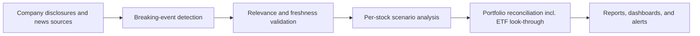

import NewsDisclaimer from '/snippets/news-disclaimer.mdx';

Parallax News Intelligence connects market events with portfolio exposure. It combines event detection, scenario analysis, and holdings reconciliation to explain how news may affect direct positions and holdings within ETFs.

## The Problem

For investors managing positions across markets, reviewing the news is only the first step. They also need to identify affected holdings, assess potential price impacts, and understand the significance for the portfolio.

News Intelligence organizes those tasks into one workflow. Scheduled and on-demand scans identify events for assessment, and portfolio reconciliation connects the analysis to the holdings it affects.

<Note>
News Intelligence is built around a simple principle: **relevance is defined by the portfolio, not by the headline.** An event only reaches you after it has been reconciled against what you actually hold, including positions held indirectly through ETFs.
</Note>

## How the Pipeline Works

The pipeline applies a consistent sequence of detection, validation, assessment, and portfolio reconciliation. Each assessment uses the available news and holdings data to estimate the event's portfolio impact.

```mermaid
graph LR
    A[Company disclosures and news sources] --> B[Breaking-event detection]
    B --> C[Relevance and freshness validation]
    C --> D[Per-stock scenario analysis]
    D --> E[Portfolio reconciliation incl. ETF look-through]
    E --> F[Reports, dashboards, and alerts]
```

| Step | What happens |
|------|--------------|
| **Monitor** | Scheduled and on-demand scans of company disclosures and news sources across major Asian and US equity markets |
| **Detect** | Keyword and relevance scoring identifies potentially market-moving items returned by each scan |
| **Validate** | A relevance and freshness check filters out stale, duplicated, or immaterial items before anything is scored |
| **Assess** | For each event that passes, automated analysis produces bull, base, and bear scenarios with probability-weighted price impact for the affected security |
| **Reconcile** | The assessed impact is mapped against actual portfolio holdings, including look-through into ETF constituents, so indirect exposure is captured alongside direct positions |
| **Deliver** | Results reach the people holding the affected positions through reports, dashboards, and alerts, with narrative context explaining the scenario math |

### Scenario Analysis

Each event assessment presents bull, base, and bear scenarios with estimated price impacts and assigned probabilities. The probability-weighted result is accompanied by the scenario assumptions and reasoning, so readers can assess how different outcomes would affect their holdings.

### Portfolio Reconciliation

Portfolio reconciliation maps assessed events to direct holdings and ETF constituents. This makes indirect exposure visible and helps readers assess each event in the context of their portfolio.

## Research Process

Automated detection, validation, and analysis organize each assessment around the event, its potential effects, and the relevant portfolio exposure.

<CardGroup cols={2}>
  <Card title="Systematic methodology" icon="gears">
    The pipeline applies a consistent detection, validation, and assessment process. Each assessment presents estimated scenario probabilities and price impacts alongside the reasoning behind them.
  </Card>
  <Card title="Validation before delivery" icon="filter">
    Multiple automated checks stand between a raw headline and your dashboard. Items are scored for relevance, checked for freshness, and reconciled against holdings before anything is surfaced. Noise is filtered out early, by design.
  </Card>
  <Card title="Quant research discipline" icon="flask">
    The pipeline follows the research standards used in Parallax's factor scoring and valuation systems: explicit assumptions, structured analysis, and reasoning that readers can assess.
  </Card>
  <Card title="Precision over breadth" icon="crosshairs">
    Holdings reconciliation filters assessments for portfolio relevance, helping readers focus on events connected to their direct and indirect exposures.
  </Card>
</CardGroup>

## What You Get

The output is a focused set of portfolio-relevant event assessments. Instead of scanning a feed and triaging headlines yourself, you receive event assessments already filtered for relevance to your holdings, already quantified through scenario analysis, and already accompanied by narrative context explaining why the event matters and how the impact estimate was reached.

The assessment provides a structured input to investment judgment, with the reasoning and assumptions available for review.

<NewsDisclaimer />

## Next Steps

<CardGroup cols={2}>
  <Card title="News Intelligence in the Console" icon="newspaper" href="/console/news">
    See how event detection, scenario analysis, and portfolio-aware alerts appear in the Parallax Console
  </Card>
  <Card title="Asset Pricing Engine" icon="calculator" href="/methodology/overview">
    The multi-factor scoring framework that News Intelligence complements with event-driven analysis
  </Card>
</CardGroup>
