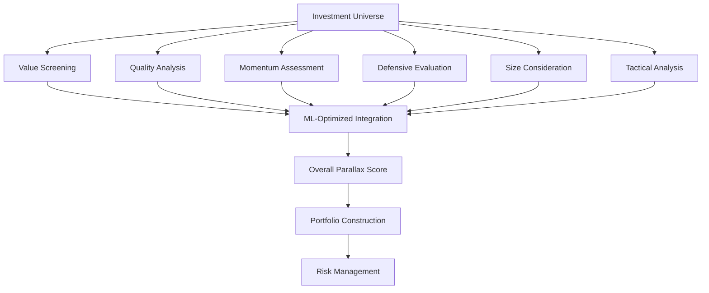

Parallax's asset pricing engine transforms academic factor research into actionable investment insights through systematic scoring, rigorous analysis, and disciplined implementation across global equity markets.

## The Multi-Dimensional Nature of Returns

Investment returns aren't driven by any single characteristic. Academic research spanning decades has identified that multiple factors explain the majority of systematic return patterns across global equity markets.

<CardGroup cols={2}>
  <Card title="Value" icon="scale-balanced">
    Markets sometimes misprice securities, creating opportunities to buy quality assets below intrinsic value.
  </Card>
  <Card title="Quality" icon="gem">
    Companies with superior business models, strong balance sheets, and sustainable competitive advantages tend to outperform.
  </Card>
  <Card title="Momentum" icon="arrow-trend-up">
    Securities exhibiting positive price and earnings trends often continue outperforming in the intermediate term.
  </Card>
  <Card title="Defensive" icon="shield-halved">
    Lower-risk securities often provide better risk-adjusted returns than high-risk securities.
  </Card>
  <Card title="Size" icon="magnifying-glass-chart">
    Company size amplifies factor signals due to attention gaps and uninformed passive flows.
  </Card>
  <Card title="Tactical" icon="crosshairs">
    Short-term liquidity dislocations create temporary mispricings that can be systematically exploited.
  </Card>
</CardGroup>

## How the Framework Works

Our multi-dimensional evaluation framework provides systematic evaluation of investment opportunities through:

| Step | Process |
|------|---------|
| **Factor Evaluation** | Every security receives scores (0-10) across all six investment factors |
| **Score Integration** | Individual factor scores combine into an overall Parallax score using ML optimization |
| **Risk Assessment** | Factor exposures analyzed for portfolio-level impact |
| **Recommendations** | Scores translated into actionable buy/sell recommendations |

## Factor Independence and Correlation

Our investment factors are chosen because they:

1. **Capture Different Return Sources**: Each factor exploits different market inefficiencies or risk premiums
2. **Show Low Correlation**: Factors often move independently, providing diversification benefits
3. **Have Economic Intuition**: Each factor has logical economic or behavioral explanations
4. **Demonstrate Persistence**: Factor premiums persist across time periods and market conditions

## Factor Interaction Dynamics

### Complementary Combinations

Some factor combinations work particularly well together:

<Note>
**Value + Quality**: Buying undervalued companies with strong fundamentals reduces "value trap" risk while maintaining value exposure.

**Quality + Momentum**: High-quality companies often exhibit sustained positive momentum as markets recognize superior fundamentals.

**Defensive + Value**: Combining low-volatility stocks with value screening provides attractive risk-adjusted returns during uncertain periods.
</Note>

### Factor Timing vs. Factor Persistence

Rather than attempting to time factors (predicting which will outperform when), we maintain **persistent exposure** to our multi-factor framework with **tactical adjustments** based on:

- **Valuation Spreads**: When factor valuations become extreme
- **Market Regime Changes**: Different factors perform better in different market environments
- **Economic Cycle Positioning**: Factor performance varies with economic conditions
- **Risk Environment**: Factor allocations adjusted during high-stress periods

## Next Steps

<CardGroup cols={2}>
  <Card title="Scoring Methodology" icon="calculator" href="/methodology/scoring">
    Learn how we calculate 0-10 scores, integrate factors with ML optimization, and generate recommendations
  </Card>
  <Card title="Factor Deep Dive" icon="microscope" href="/methodology/factors">
    Detailed implementation of each factor including metrics, academic foundations, and use cases
  </Card>
  <Card title="Risk Management" icon="shield" href="/methodology/risk-management">
    Comprehensive risk framework including stress testing, controls, and monitoring
  </Card>
</CardGroup>
